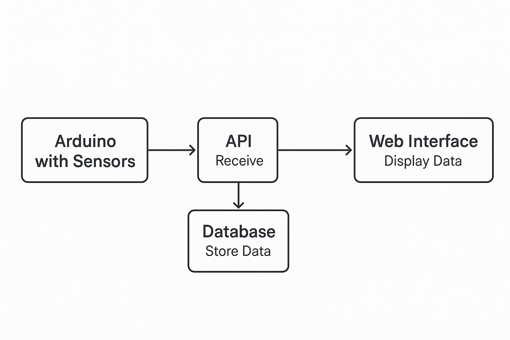

# API IoT — Sistema de Monitoreo IoT con Arduino y Python

Este proyecto implementa un **sistema de Internet de las Cosas (IoT)** que permite conectar dispositivos físicos (como un **Arduino con sensores**) con una **API desarrollada en Python** y una **interfaz web** para visualizar los datos en tiempo real.

---

## Descripción General

El sistema está diseñado para recibir datos desde sensores conectados a un Arduino, enviarlos mediante HTTP a una API (backend en **Python Flask**), almacenarlos en una **base de datos SQL** y finalmente mostrarlos a través de una **interfaz web**.

Es ideal para proyectos educativos, de investigación o prototipos IoT donde se requiera monitorear variables ambientales como temperatura, humedad, luz, etc.

---

## Arquitectura General

El flujo de funcionamiento del sistema es el siguiente:

1. **Arduino con sensores:** mide variables del entorno (ej. temperatura o humedad). 
2. **API IoT (Python Flask):** recibe los datos y los guarda en la base de datos. 
3. **Base de Datos (SQL):** almacena el historial de mediciones. 
4. **Interfaz Web (Frontend):** consulta el API y muestra los datos en tiempo real mediante gráficos o tablas.

---

## Diagrama de Flujo del Sistema



---

## Estructura del Proyecto

```
API_IoT/
├── arduino_code/          # Código del Arduino para envío de datos
├── frontend/              # Interfaz web para visualizar lecturas
├── run.py                 # Punto de entrada del servidor Flask
├── wsgi.py                # Configuración para despliegue (Gunicorn)
├── requirements.txt       # Dependencias de Python
├── Dockerfile             # Imagen base para contenedores
├── docker-compose.yml     # Orquestador para levantar API + BD + Frontend
└── IoT.session.sql        # Script SQL para la base de datos
```

---

## Instalación y Ejecución

### 🔸 Opción 1 — Docker (Recomendada)

Asegúrate de tener **Docker** y **Docker Compose** instalados.

```bash
# Clonar el repositorio
git clone https://github.com/santiagoVL03/API_IoT.git
cd API_IoT

# Construir y levantar los contenedores
docker compose up --build
```

La API quedará disponible en `http://localhost:5000` 
El frontend en `http://localhost:8080` (o el puerto configurado)

---

### 🔸 Opción 2 — Ejecución Local (sin Docker)

1. Crear entorno virtual e instalar dependencias:

```bash
python -m venv venv
source venv/bin/activate  # En Windows: venv\Scripts\activate
pip install -r requirements.txt
```

2. Configurar las variables de entorno (por ejemplo):

```bash
export FLASK_APP=run.py
export DATABASE_URL="sqlite:///iot.db"
```

3. Ejecutar el servidor:

```bash
python run.py
```

---

## Conexión con el Arduino

El código del Arduino envía los datos en formato JSON al endpoint de la API, por ejemplo:

```cpp
#include <WiFi.h>
#include <HTTPClient.h>

void loop() {
  float temp = 24.7;
  float hum  = 62.3;

  HTTPClient http;
  http.begin("http://<IP_DEL_SERVIDOR>:5000/api/data");
  http.addHeader("Content-Type", "application/json");

  String json = "{\"temperatura\": " + String(temp) + ", \"humedad\": " + String(hum) + "}";
  http.POST(json);
  http.end();

  delay(5000);
}
```

---

## Tecnologías Utilizadas

| Componente | Tecnología | Descripción |
|-------------|-------------|--------------|
| **Backend** | Python Flask | API REST para recibir y procesar datos |
| **Frontend** | HTML / JS / CSS | Interfaz de usuario para visualizar datos |
| **Base de Datos** | SQLite / MySQL | Almacenamiento de lecturas IoT |
| **Hardware** | Arduino / ESP32 | Dispositivo físico que envía las lecturas |
| **Infraestructura** | Docker / Docker Compose | Despliegue y contenedorización del sistema |

---

## Licencia

Este proyecto se distribuye bajo la licencia **MIT**. 
Puedes usarlo libremente con fines educativos o de investigación.

---

## Autor

**SantiagoVL03** 
Repositorio original: [github.com/santiagoVL03/API_IoT](https://github.com/santiagoVL03/API_IoT)
